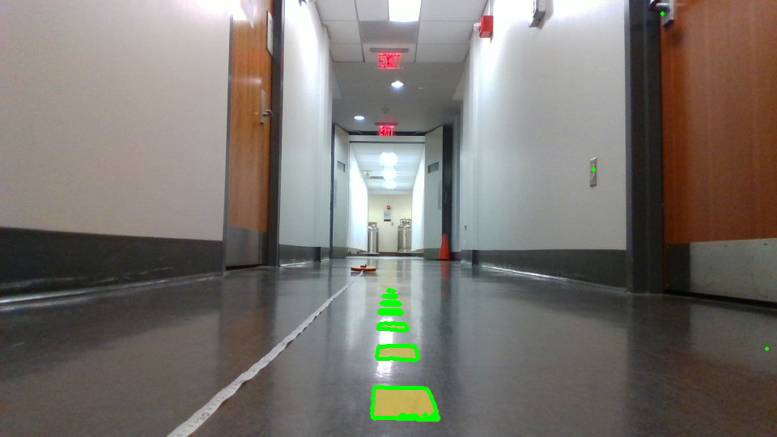
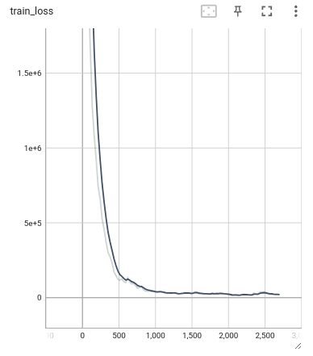
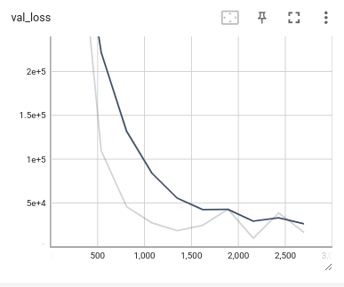
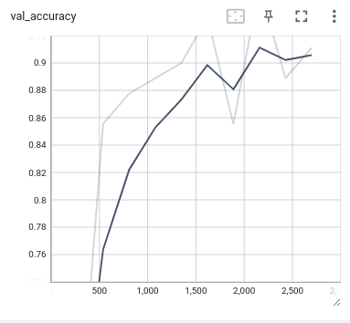

# Lab 8: Vision Lab

## The x, y distance of the unknown cones?
Camera Matrix: [[693.67802518   0.         448.53488247]
 [  0.         694.76842431 258.05030476]
 [  0.           0.           1.        ]]

Distance to the Unknown Cone is: (0.66801404054058, -0.14008334903862577) meters

## Lane Detection Result Image
Process: 

* HSV Threshold for mask
    * h_min = 21, h_max = 31, v_min = 89, v_max = 255, s_min = 56, s_max = 157
* Opening morpological operation with kernel of size 5x5
* Find contours and draw on top of image

## Integrated Object Detection + Distance Calculation Result Image
There were no instructions for this

## Nerual Network Training & Testing Loss Plot
We used the YOLO architecture here as a modification to get improved accuracy. 

## Is FP16 faster? Why?
FP16 inference time (ms): (FILL ME IN)

FP32 inference time (ms): (FILL ME IN)

You should time only the inference part and average out at least 100 inference cycles.
